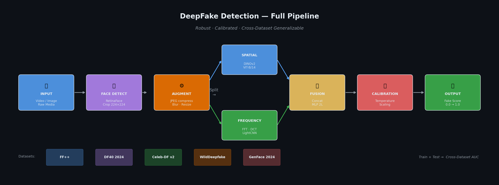
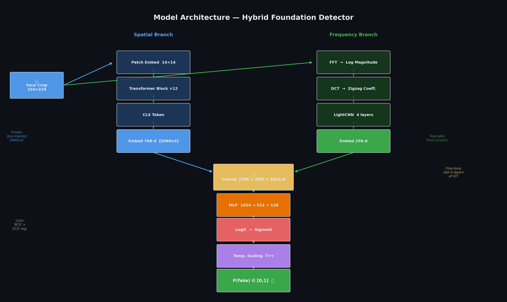

# DeepFake Detection

Robust deepfake detection system using a hybrid **DINOv2 + Frequency Analysis** architecture. Detects deepfakes in images and videos, including content generated by modern diffusion models (Stable Diffusion, FLUX, Midjourney v6).

## Architecture

```
Input → Face Detection → Dual Branch → Fusion → Calibrated Score
           (OpenCV)    ┌─ DINOv2 ViT-B/14 (768-d)  ┐
                       └─ FFT + DCT → LightCNN (256-d) ┘
                                   ↓
                          MLP Fusion (1024 → 1)
                                   ↓
                       Temperature Scaling → P(fake)
```

- **Spatial branch**: DINOv2 ViT-B/14 pretrained, last 4 blocks fine-tuned
- **Frequency branch**: FFT log-magnitude + DCT-II → 4-layer LightCNN
- **Calibration**: Temperature Scaling for reliable probability output
- **Explainability**: Grad-CAM attention maps on ViT blocks

## Datasets (2019–2026)

| Dataset | Year | Role | Type |
|---------|------|------|------|
| FaceForensics++ (C23) | 2019 | Train | Face-swap, neural |
| DF40 | 2024 | Train | 40 methods incl. diffusion |
| AV-Deepfake1M | 2023 | Train | In-the-wild large scale |
| Celeb-DF v2 | 2020 | Test | Realistic face-swap |
| WildDeepfake | 2020 | Test | Real-world conditions |
| GenFace | 2024 | Test | Diffusion-generated faces |

## Installation

```bash
git clone https://github.com/anessrb/Deepfakedetection.git
cd Deepfakedetection
python3 -m venv venv
source venv/bin/activate
pip install -r requirements.txt
```

## Usage

### 1. Preprocess Dataset
```bash
python scripts/preprocess_dataset.py \
    --input_dir data/raw/ff++ \
    --output_dir data/ff++ \
    --dataset ff++ \
    --fps 1 --max_frames 300
```

### 2. Train
```bash
python scripts/train.py --config configs/default.yaml
```

### 3. Cross-Dataset Evaluation
```bash
python scripts/evaluate.py \
    --checkpoint checkpoints/best.pth \
    --output_dir outputs/evaluation/
```

### 4. Inference (Image or Video)
```bash
# Image
python scripts/inference.py \
    --input face.jpg \
    --checkpoint outputs/detector_calibrated.pth

# Video
python scripts/inference.py \
    --input video.mp4 \
    --checkpoint outputs/detector_calibrated.pth \
    --fps 2 --aggregate mean
```

### 5. Calibrate
```bash
python scripts/calibrate.py \
    --checkpoint checkpoints/best.pth \
    --output_dir outputs/
```

## Project Structure

```
DeepFakeDetection/
├── configs/
│   └── default.yaml          # Full training/eval configuration
├── src/
│   ├── preprocessing/        # Frame extraction + face detection
│   ├── datasets/             # FF++, Celeb-DF, DF40, WildDeepfake loaders
│   ├── models/               # DINOv2 spatial, frequency branch, detector
│   ├── training/             # Trainer, FocalLoss, ECELoss
│   ├── evaluation/           # AUC, ECE, cross-dataset, robustness
│   └── visualization/        # Grad-CAM, calibration plots, ROC curves
├── scripts/                  # CLI entry points
├── notebooks/                # Dataset exploration notebook
└── requirements.txt
```

## Evaluation Metrics

- **AUC-ROC**: Primary metric, cross-dataset generalization
- **ECE**: Expected Calibration Error (target < 0.05)
- **Robustness**: AUC under JPEG 30–100%, Gaussian blur, resize
- **Explainability**: Grad-CAM heatmaps highlighting manipulation zones

## Visuals

| Pipeline | Architecture | Poster |
|----------|-------------|--------|
|  |  |  |

## References

- **DINOv2**: Oquab et al., 2023 — Self-supervised Vision Transformers
- **FaceForensics++**: Rössler et al., 2019
- **DF40**: Yan et al., 2024 — 40-method deepfake benchmark
- **Celeb-DF**: Li et al., 2020
- **Temperature Scaling**: Guo et al., 2017 — On Calibration of Modern Neural Networks
